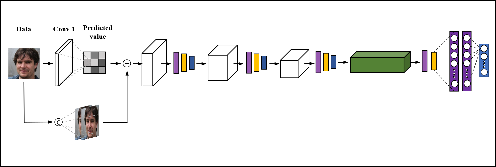

# 基于掩码的图像篡改痕迹提取

- 基于Mask思想，对现有卷积神经网络模型增加预处理结构，提升其检测深伪图像的能力。

- 简化AMTENnet模型。

## 1.环境

- caffe

- python2.7

## 2.模型结构

## 3.数据集

- StyleGAN2数据集来自[Kaggle](https://www.kaggle.com/hyperclaw79/fakefaces)

- CelebA-HQ数据集来自[CelebA官网](http://mmlab.ie.cuhk.edu.hk/projects/CelebA.html)
